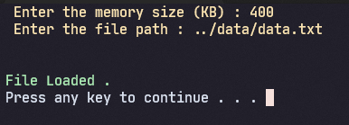

# Basic Memory Allocator Simulator.

*This is just an assignement i had to do related to my OS class*

```
What this program does is it takes a .txt file as an input (formatted in a way so that it can be interpreted by the program) and it prints out how the data in that text file would be allocated in memory according to these algorithms :
    First Fit
    Best Fit
    Worst Fit
```

PS : simple OS compaction have been implemented .

**Please note that this is a very basic simulation.**


## Main Menu 


## Data Prompt


## First Fit


### Explanatory paragraphs will come soon .
